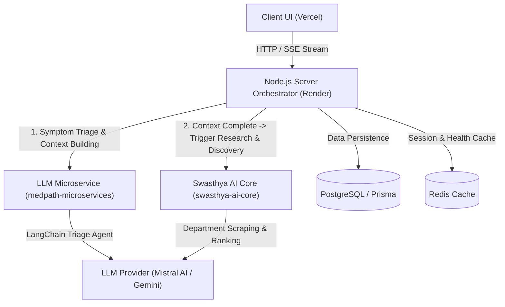

# MedPath - Guided Healthcare & AI Clinical Navigation Platform

<div align="center">
  
</div>

MedPath is an AI-powered, location-aware guided healthcare platform designed to simplify clinical triage, streamline symptom analysis, and match patients with local clinical departments and healthcare providers.

---

## 🌐 Live Deployments & Cloud Environments

| Component / Service | Description / Role | Platform | Live URL / Endpoint | Status |
| :--- | :--- | :--- | :--- | :--- |
| **Frontend Web App** | Patient Portal, Dictation & Chat UI | Vercel | [medpath-v1-ak.vercel.app](https://medpath-v1-ak.vercel.app/) |  |
| **Node.js Express Backend API** | Central Orchestrator, Auth & Database Gateway | Render | [medpath-server.onrender.com](https://medpath-server.onrender.com/) |  |
| **LLM Microservice** | **Phase 1**: Real-time Symptom Triage & Context Extraction | Render | [medpath-microservices.onrender.com](https://medpath-microservices.onrender.com/) |  |
| **Swasthya AI Core** | **Phase 2**: Full Clinical Research, Scraping & Hospital Discovery | Render | [swasthya-ai-core.onrender.com](https://swasthya-ai-core.onrender.com/) |  |

---

## 🌟 Key Features

- 🩺 **Two-Phase Clinical Assessment**:
  1. **Phase 1 (Triage Chat & Context Extraction)**: Real-time streaming symptom analysis via the **LLM Microservice** (`medpath-microservices.onrender.com`).
  2. **Phase 2 (Clinical Research & Discovery)**: Once patient context is complete, the **Swasthya AI Core** (`swasthya-ai-core.onrender.com`) triggers background clinical department scraping, hospital discovery, and ranking.
- ⚡ **Optimistic & Flicker-Free UI**: Smooth Server-Sent Events (SSE) streaming with permanent message mounting and interactive status indicators.
- 📍 **Geospatial Hospital Discovery**: Real-time matching of identified symptoms against local clinical departments, distance, and estimated care costs.
- 🎙️ **Voice Dictation**: Hands-free symptom input using integrated Web Speech API dictation.
- 🛡️ **HIPAA-Inspired Security & Authentication**: Firebase Authentication paired with JWT validation and role-based access.
- ⭐️ **Patient Reviews & Ratings System**: Verified patient experience reviews with detailed ratings across cleanliness, wait times, and staff responsiveness.
- 🎨 **Modern Glassmorphic Design System**: Light and dark mode support built with Tailwind CSS, custom design tokens, and fluid Framer Motion animations.

---

## 🏗️ Architecture & Technology Stack

MedPath uses a multi-tier microservice workflow:



### 1. Frontend (`/client`)
- **Live App**: [https://medpath-v1-ak.vercel.app/](https://medpath-v1-ak.vercel.app/)
- **Framework**: React 19 + Vite 8
- **Styling**: Tailwind CSS v4, Custom Glassmorphic Design System
- **State & Routing**: React Router v7, React Context API

### 2. Backend API (`/server`)
- **Live Endpoint**: [https://medpath-server.onrender.com/](https://medpath-server.onrender.com/)
- **Runtime**: Node.js (>=18.0) + Express
- **Database & ORM**: Prisma ORM with PostgreSQL / SQLite
- **Auth**: Firebase Admin SDK

### 3. LLM Microservice (`/llm`)
- **Live Service**: [https://medpath-microservices.onrender.com/](https://medpath-microservices.onrender.com/)
- **Role**: Initial triage chat, prompt orchestration, symptom extraction, and streaming SSE responses.

### 4. Swasthya AI Core
- **Live Service**: [https://swasthya-ai-core.onrender.com/](https://swasthya-ai-core.onrender.com/)
- **Role**: Asynchronous clinical department discovery, hospital scraping, suitability ranking, and task progress polling.

---

## 📁 Repository Structure

```text
MedPath/
├── client/                     # React 19 + Vite Frontend Application
│   ├── src/
│   │   ├── components/         # Reusable UI Primitives & Chat Components
│   │   │   ├── chat/           # Streaming Bubble, Thinking Cards, Discovery Card
│   │   │   ├── location/       # Location Permission Modal & Manual Form
│   │   │   └── ui/             # Card, Button, Input, Badge, ProgressBar
│   │   ├── context/            # Auth, Conversation, Location & Theme Contexts
│   │   ├── layouts/            # Main Responsive App Layout & Sidebar
│   │   ├── pages/              # ChatPage, Dashboard, HospitalDetails, Reviews
│   │   └── services/           # Axios API Client & Conversation SSE Stream
│   ├── index.css               # Design Tokens & Custom CSS Utilities
│   └── vite.config.js
│
├── server/                     # Node.js + Express Backend API
│   ├── prisma/                 # Prisma Database Schema & Migrations
│   ├── src/
│   │   ├── config/             # Environment Configurations & Firebase Admin
│   │   ├── modules/            # Auth, AI, Conversations, Reviews Modules
│   │   ├── routes/             # Express API Route Handlers
│   │   └── services/           # Discovery Polling & Swasthya Integration Service
│   └── server.js
│
├── llm/                        # Swasthya AI Core (Python FastAPI Microservice)
│   ├── app/
│   │   ├── agents.py           # Clinical Triage & Prompt Orchestrator
│   │   ├── config.py           # Pydantic BaseSettings
│   │   ├── memory.py           # Conversation State & Context Extraction
│   │   ├── prompts/            # Triage & Symptom Parsing Prompts
│   │   └── schemas.py          # Input/Output Request Pydantic Models
│   └── main.py                 # FastAPI App Entrypoint
│
├── DESIGN_SYSTEM.md            # Frontend UI Design System Specifications
├── LOCATION.md                 # Location Engine & Geolocation Documentation
└── REVIEW_SYSTEM.md            # Patient Reviews Architecture Documentation
```

---

## 🚀 Getting Started

### Prerequisites

Ensure you have the following installed on your machine:
- **Node.js**: `v18.0.0` or higher
- **npm**: `v9.0.0` or higher
- **Python**: `3.10` or higher
- **Git**

---

### 🛠️ Installation & Local Setup

#### 1. Clone the Repository
```bash
git clone https://github.com/Amankumar140/MedPath.git
cd MedPath
```

---

#### 2. Setup Swasthya AI Core Microservice (Python FastAPI)
```bash
cd llm
python -m venv venv

# On Windows:
venv\Scripts\activate
# On macOS/Linux:
# source venv/bin/activate

pip install -r requirements.txt
```

Create a `.env` file in the `llm/` directory:
```env
MISTRAL_API_KEY=your_mistral_api_key_here
PORT=8000
LOG_LEVEL=INFO
```

Start the FastAPI service:
```bash
python -m uvicorn app.main:app --reload --port 8000
```

---

#### 3. Setup Server (Node.js API)
In a new terminal window:
```bash
cd server
npm install
```

Create a `.env` file in the `server/` directory:
```env
PORT=3000
DATABASE_URL="file:./dev.db" # or PostgreSQL connection string
SWASTHYA_API_URL="https://swasthya-ai-core.onrender.com" # or http://localhost:8000
PYTHON_MICROSERVICE_URL="https://swasthya-ai-core.onrender.com"
JWT_SECRET="your_jwt_secret_key"
NODE_ENV="development"
```

Initialize Database & Start Dev Server:
```bash
npm run db:generate
npm run db:migrate:dev
npm run dev
```

---

#### 4. Setup Client (React Frontend)
In a third terminal window:
```bash
cd client
npm install
```

Create a `.env` file in the `client/` directory:
```env
VITE_API_URL="http://localhost:3000/api/v1"
```

Start the Frontend Dev Server:
```bash
npm run dev
```

Open your browser and navigate to `http://localhost:5173`.

---

## 🧪 Testing & Verification

### Running Frontend Linter
```bash
cd client
npm run lint
```

### Running Swasthya AI Microservice Tests
```bash
cd llm
pytest
```

---

## 📋 API Reference Summary

| Method | Endpoint | Description |
| :--- | :--- | :--- |
| `POST` | `/api/v1/auth/session` | Authenticate user & sync profile |
| `GET` | `/api/v1/conversations` | List user consultation history |
| `POST` | `/api/v1/conversations` | Start a new consultation session |
| `POST` | `/api/v1/conversations/:id/messages` | Stream user message via SSE relay |
| `GET` | `/api/v1/conversations/:id/discovery/progress` | Poll background Swasthya AI department search |
| `GET` | `/api/v1/hospitals` | Search & filter local hospitals by location/symptoms |
| `POST` | `/api/v1/reviews` | Submit patient experience review |

---

## ⚠️ Medical Disclaimer

MedPath is an AI-assisted guidance tool designed for informational and navigation purposes only. It is **not** a substitute for professional medical advice, diagnosis, or emergency care. In case of a medical emergency, please immediately contact your local emergency services or visit the nearest emergency room.

---

## 📄 License

Distributed under the MIT License. See `LICENSE` for more information.
