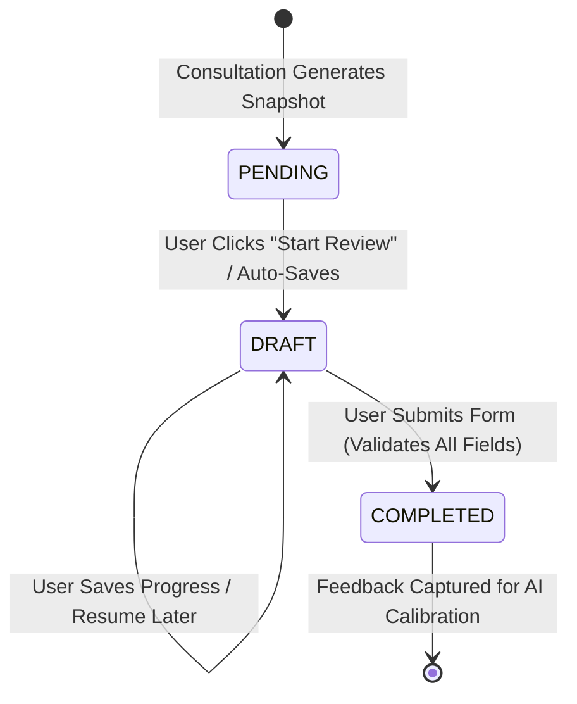
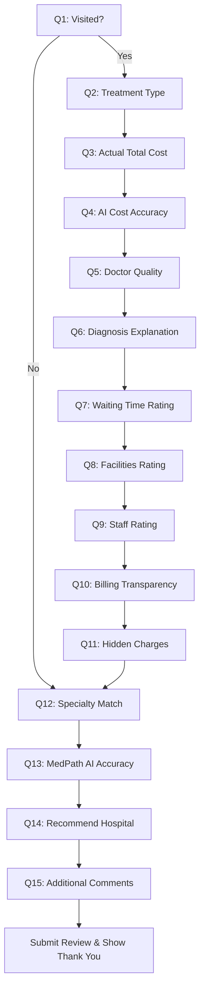

# Post-Visit Review System & Hospital Intelligence

This documentation outlines the design, architecture, database models, and API interfaces for the Post-Visit Review System.

---

## 1. Objectives & Guidelines

- **Purpose**: Collect real-world patient outcomes (actual costs, waiting times, and ratings) linked directly to recommendations generated during AI triage consultations.
- **Constraints**:
  - **No Dynamic Reranking**: Under no circumstances should this review system dynamically modify AI search rankings or recommendations.
  - **Data Accumulation**: Ratings and reviews are stored for model calibration. The Python/AI research team may ingest this structured feedback for offline model training in the future.

---

## 2. Review Lifecycle

The lifecycle of a hospital review transitions through three states:



1. **PENDING**: Generated automatically when an AI triage consultation provides recommended hospitals. These snapshots remain pending until a review is started.
2. **DRAFT**: Created when the user answers any question in the wizard and clicks "Save Draft" or "Resume Later". Partial and nullable data is allowed.
3. **COMPLETED**: Created when the user completes all wizard steps and submits. High-fidelity validation is enforced (e.g. positive costs, rating limits, non-empty treatment type).

---

## 3. Database Schema

The system uses a PostgreSQL database managed via Prisma ORM. The `HospitalReview` model is structured as follows:

```prisma
model HospitalReview {
  id                       String                 @id @default(uuid()) @db.Uuid
  userId                   String                 @map("user_id") @db.Uuid
  conversationId           String                 @map("conversation_id") @db.Uuid
  recommendationSnapshotId String                 @map("recommendation_snapshot_id") @db.Uuid
  hospitalName             String                 @map("hospital_name")
  visited                  Boolean?
  treatmentType            String?                @map("treatment_type")
  estimatedCost            String?                @map("estimated_cost")
  actualCost               Float?                 @map("actual_cost")
  costAccuracy             String?                @map("cost_accuracy")
  doctorQuality            Int?                   @map("doctor_quality")
  diagnosisExplanation     Int?                   @map("diagnosis_explanation")
  waitingTimeRating        Int?                   @map("waiting_time_rating")
  facilityRating           Int?                   @map("facility_rating")
  staffRating              Int?                   @map("staff_rating")
  billingTransparency      Int?                   @map("billing_transparency")
  hiddenCharges            String?                @map("hidden_charges")
  specialtyMatch           Int?                   @map("specialty_match")
  medpathAccuracy          Int?                   @map("medpath_accuracy")
  hospitalRecommendation   String?                @map("hospital_recommendation")
  reviewText               String?                @map("review_text") @db.Text
  status                   String                 @default("DRAFT")
  createdAt                DateTime               @default(now()) @map("created_at") @db.Timestamptz
  updatedAt                DateTime               @default(now()) @updatedAt @map("updated_at") @db.Timestamptz

  user                   User                   @relation(fields: [userId], references: [id], onDelete: Cascade)
  conversation           Conversation           @relation(fields: [conversationId], references: [id], onDelete: Cascade)
  recommendationSnapshot RecommendationSnapshot @relation(fields: [recommendationSnapshotId], references: [id], onDelete: Cascade)

  @@unique([recommendationSnapshotId])
  @@map("hospital_reviews")
}
```

### Relations
- **User**: Cascade deletes reviews if the patient account is deleted.
- **Conversation**: Cascade deletes reviews if the consultation history is cleared.
- **RecommendationSnapshot**: Ensures a strict 1-to-1 unique mapping; a specific recommendation snapshot can be reviewed at most once.

---

## 4. API Endpoints

All API endpoints are mounted under `/api/v1/reviews` and require a valid Bearer token (`verifyFirebaseToken` middleware).

### 1. Get Feedback Dashboard History
- **Path**: `GET /api/v1/reviews/history`
- **Response**: Standardized JSON containing Completed, Drafts, and Pending review items.
```json
{
  "success": true,
  "data": {
    "completed": [...],
    "drafts": [...],
    "pending": [...]
  }
}
```

### 2. Fetch Review by Conversation ID
- **Path**: `GET /api/v1/reviews/:conversationId`
- **Response**: Array of reviews written for recommendation snapshots generated during that conversation.

### 3. Create Review / Save Initial Draft
- **Path**: `POST /api/v1/reviews`
- **Body**: See fields above (supports partial fields for drafts).
- **Validation**: Strict validation of required fields if `status === "COMPLETED"`.

### 4. Update Review Draft / Submit Review
- **Path**: `PATCH /api/v1/reviews/:id`
- **Body**: Partial or complete payload (triggers high-fidelity validation if transitioning `status` to `"COMPLETED"`).

### 5. Delete Review or Draft
- **Path**: `DELETE /api/v1/reviews/:id`
- **Description**: Hard-deletes the review draft or completed review record.

---

## 5. Review Wizard Flow

The wizard provides a 15-step guided questionnaire. It avoids a single long form, displaying one question at a time and tracking progress dynamically.

### Dynamic Skipping Logic
If the user selects **"No"** to Question 1 (*"Did you actually visit this hospital?"*):
- Questions 2 to 11 (treatment type, cost, cost accuracy, doctor quality, explanation, wait time, facility rating, staff rating, billing transparency, hidden charges) are irrelevant.
- The wizard dynamically adjusts, skipping directly to Question 12.
- The progress indicator updates the step count (e.g. Question 2 of 5) to maintain layout consistency.



### Questionnaire Config

| Step | Field | Type | Options / Choices |
|---|---|---|---|
| **1** | `visited` | Pill Yes/No | Yes, No |
| **2** | `treatmentType` | Text | Short Answer |
| **3** | `actualCost` | Currency | Numeric input |
| **4** | `costAccuracy` | Option Cards | Very Accurate, Accurate, Slightly Different, Very Different |
| **5** | `doctorQuality` | Star rating | 1 to 5 Stars |
| **6** | `diagnosisExplanation` | Star rating | 1 to 5 Stars |
| **7** | `waitingTimeRating` | Star rating | 1 to 5 Stars |
| **8** | `facilityRating` | Star rating | 1 to 5 Stars |
| **9** | `staffRating` | Star rating | 1 to 5 Stars |
| **10**| `billingTransparency` | Star rating | 1 to 5 Stars |
| **11**| `hiddenCharges` | Option Cards | None, Minor, Moderate, Significant |
| **12**| `specialtyMatch` | Star rating | 1 to 5 Stars |
| **13**| `medpathAccuracy` | Star rating | 1 to 5 Stars |
| **14**| `hospitalRecommendation` | Option Cards | Definitely, Probably, Maybe, Probably Not, Never |
| **15**| `reviewText` | Textarea | Detailed comment box |

---

## 6. Future AI & Offline Model Training

The reviews database is isolated from runtime AI ranking/filtering. In the future, the data science/AI team can load reviews to:
1. **Analyze Cost Estimation Error**:
   ```sql
   SELECT actual_cost, estimated_cost, cost_accuracy FROM hospital_reviews WHERE visited = true;
   ```
2. **Review Triage Suitability**:
   Cross-reference `medpath_accuracy` with the initial parsed symptoms in the `patient_contexts` table using `conversation_id`.
3. **Calibrate Facilities Score**:
   Compare user `facility_rating` and `doctor_quality` against AI-scraped static confidence values.
