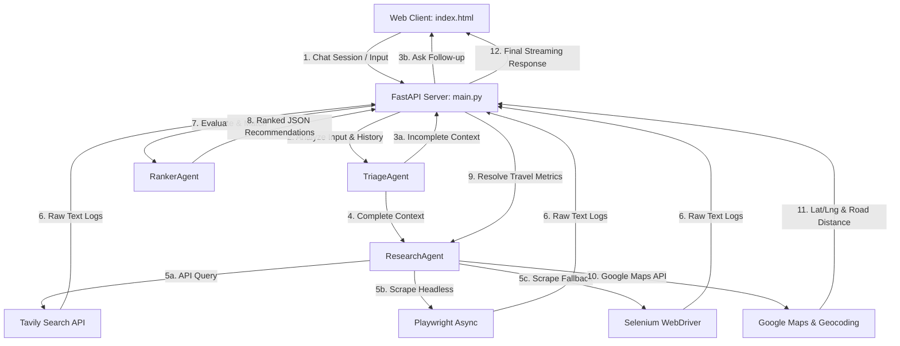

# MedPath Microservice Engine Blueprint

Welcome to the MedPath Core Microservice developer guide. This document serves as the architectural specification and implementation handbook for the Core Microservices layer. It details the system's design, operational pipelines, component APIs, and integration boundaries.

---

## 🗺️ Architectural Overview

MedPath operates as a stateful, pipeline-driven medical triage and routing engine. It uses a **multi-agent orchestration workflow** to intake patient symptoms, gather clinical data in real-time, compute decision matrices, and recommend the best local medical facilities.



---

## 🛠️ Folder Structure

The microservices layer is self-contained and structured as a Python package:

```text
microservices/
├── agents/
│   ├── __init__.py
│   ├── ranker_agent.py       # LLM decision matrix & hospital ranking
│   ├── research_agent.py     # Live scraping & Google Maps APIs
│   └── triage_agent.py       # Conversational parsing & parameter extraction
├── .env                      # API keys (Google Gemini, Mistral, Tavily, Maps)
├── .gitignore                # Python-specific git rules
├── .venv/                    # Python isolated virtual environment
├── Dockerfile                # Multi-stage Linux/Chromium container file
├── config.py                 # Core LLM initialization & dotenv configurations
├── index.html                # Client UI template served by the API
├── main.py                   # FastAPI streaming service & session storage
├── requirements.txt          # Package dependencies
└── schemas.py                # Pydantic data schemas
```

---

## ⚡ Component Deep-Dive

### 1. Gateway Server (`main.py`)
- **Framework**: FastAPI
- **Session Management**: Memory-cached stateful dictionary `SESSION_STORAGE` tracking conversation histories per `session_id`.
- **API Endpoint**: `/api/chat` (HTTP `POST` using chunked text/plain streaming response).
- **Execution Flow**:
  1. Receives input parameters via `ChatRequest`.
  2. Runs a streaming generator `execution_stream()`.
  3. Yields status messages in JSON chunks (e.g. `{"type": "status", "message": "..."}`).
  4. Delegates to `TriageAgent` to check context completeness.
  5. If complete, runs `ResearchAgent` to fetch search pages, parses content, and resolves distances.
  6. Runs `RankerAgent` to output structured recommendations.
  7. Formats the response into `ChatResponse` and yields the final payload (`type: final`).

---

### 2. Triage Coordinator (`agents/triage_agent.py`)
- **Purpose**: Conversational extraction of patient metadata.
- **Completion Criteria**: To proceed to the research phase, the agent must extract four critical variables:
  1. `symptoms` (Clinical issues)
  2. `age` (Patient age)
  3. `location` (City, locality, or coordinates)
  4. `care_intent` (OPD consultation, surgery/operation, or emergency)
- **Failover Setup**:
  - **Primary**: Google Gemini (`gemini-2.5-latest`) configured with `.with_structured_output(PatientContext)`.
  - **Fallback**: Mistral AI (`mistral-large-latest`) structured output activated if Gemini fails.
- **Language Mandate**:
  - Automatically locks conversation language to **English** (`en`), **Hindi** (`hi`), or **Hinglish** (`hinglish`) based on the conversation history.
  - Ensures the user is asked questions only in the locked language script.

---

### 3. Research Engine (`agents/research_agent.py`)
- **Purpose**: Collects web evidence and matches physical distances.
- **Scraping Frameworks**:
  1. **Tavily API**: Fast search indexing for medical registries.
  2. **Selenium WebDriver**: Configured for headless Chrome running inside Docker/Linux.
  3. **Playwright**: Async browser session parsing raw HTML, removing script/nav elements for clean DOM text extraction.
- **Google Maps Integration**:
  - **Geocoding API**: Resolves hospital coordinates (`latitude`, `longitude`).
  - **Distance Matrix API**: Computes road driving distance and driving times (e.g., `4.5 km (12 mins drive)`) relative to the patient's specified location.

---

### 4. Ranker Engine (`agents/ranker_agent.py`)
- **Purpose**: Processes scraped text logs and scores hospital options.
- **Output Schema**: Pydantic structured `FinalResearchResult`.
- **Rules**:
  - **Strict Anti-Hallucination**: Filters and lists only real hospitals present in the scrapers' raw logs.
  - **Scoring System**: Calculates confidence scores (0.0 to 1.0) and trust indices (1.0 to 5.0) matching NABH status and search results.
  - **Suitability Details**: Outlines clinical specialization matching user symptoms.

---

## 🗄️ Shared Schemas (`schemas.py`)

All cross-component data transfer boundaries are guarded by Pydantic models:

| Model Name | Field | Type | Description |
| :--- | :--- | :--- | :--- |
| **`PatientContext`** | `symptoms`<br>`age`<br>`duration_days`<br>`location`<br>`care_intent`<br>`budget`<br>`detected_language`<br>`is_context_complete`<br>`follow_up_question` | `Optional[str]` / `int` / `bool` | Contains triage state variables and follow-up prompts. |
| **`ScrapedHospitalData`** | `name`<br>`source`<br>`raw_text`<br>`url`<br>`rating` | `str` / `Optional[float]` | Format for all website content scrapers. |
| **`HospitalRecommendation`**| `hospital_name`<br>`ranking_position`<br>`confidence_score`<br>`estimated_cost`<br>`distance`<br>`trust_score`<br>`suitability`<br>`explanation`<br>`latitude`<br>`longitude` | `str` / `float` / `Optional[float]` | Detailed recommended hospital model returned to client. |
| **`FinalResearchResult`** | `recommended_hospitals` | `List[HospitalRecommendation]` | Ordered array wrapper for the target facilities. |

---

## ⚙️ Setup and Execution

### Environment Keys (`.env`)
The service requires the following environment variables:
```bash
GEMINI_API_KEY=your_gemini_api_key
MISTRAL_API_KEY=your_mistral_api_key
TAVILY_API_KEY=your_tavily_search_key
GOOGLE_MAPS_API_KEY=your_google_maps_key
```

### Local Dev Server
1. Navigate into the microservices folder:
   ```bash
   cd microservices
   ```
2. Activate your virtual environment:
   ```powershell
   .venv\Scripts\Activate.ps1
   ```
3. Launch the API:
   ```bash
   python main.py
   ```
4. Access the workspace UI:
   Open `http://127.0.0.1:8000/` in your browser.
