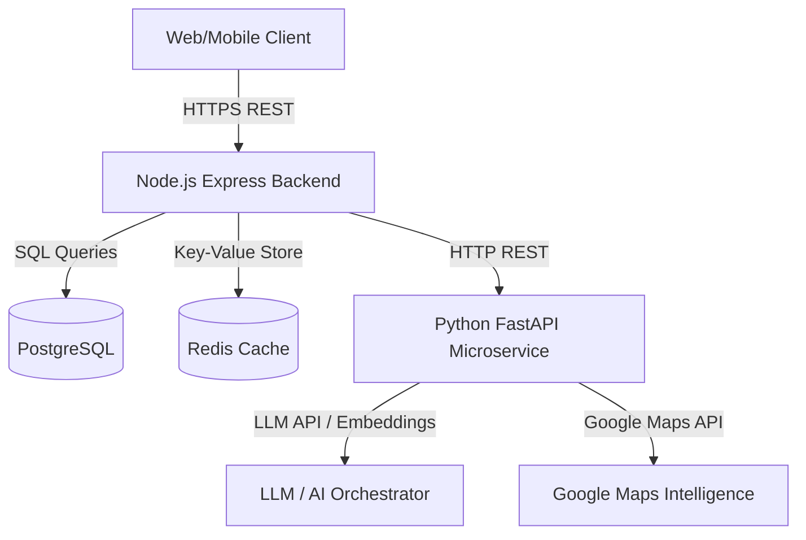
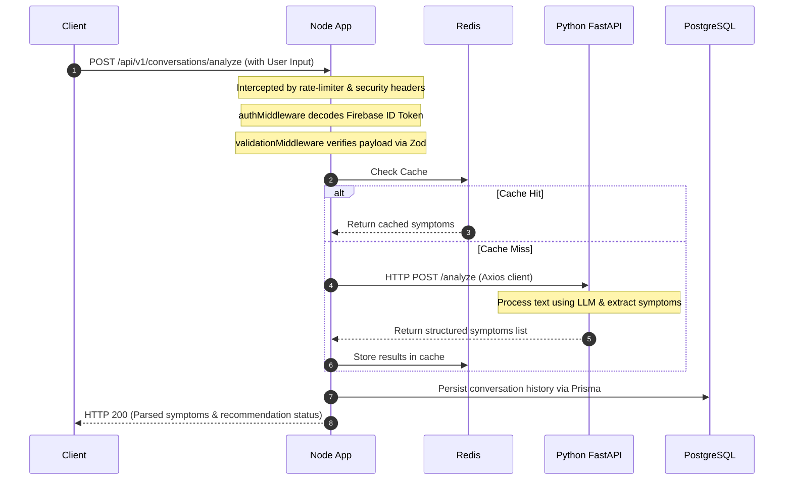

# MedPath Architecture & Foundation Guide

Welcome to the **MedPath Backend Foundation**. This document details the architectural boundaries, folder responsibilities, and system design patterns established for MedPath, an AI-powered healthcare recommendation platform.

---

## 1. Directory Structure & Responsibilities

The codebase follows a modular clean-architecture design. The structure and responsibilities of each directory are outlined below:

```
server/
├── prisma/                   # Database schemas and seed configuration
│   ├── schema.prisma         # Prisma single source of truth database schema
│   └── seed.js               # Database seeding logic for local development
├── uploads/                  # Temporary and local file uploads storage
├── logs/                     # Winston output directory (error.log and combined.log)
├── tests/                    # Integration and unit tests
├── src/                      # Source code root
│   ├── config/               # App configuration, database connection, and SDK initiations
│   ├── middleware/           # Express request flow hook-ins (validation, error, security)
│   ├── modules/              # Clean modular business logic features (auth, users, etc.)
│   ├── routes/               # Global router and API version prefixes
│   ├── services/             # Core infrastructure services (cache client, exterior microservice client)
│   ├── utils/                # General-purpose utility helpers
│   ├── constants/            # Global application constants and HTTP status markers
│   ├── validators/           # Shared schema validation rules (Zod)
│   ├── app.js                # Core Express application and middleware bootstrap
│   └── server.js             # Application entrypoint, DB/Redis connecting, and process shutdown hooks
```

### Folder Responsibilities

*   **`src/config/`**: Holds environmental parser schemas and initializers for Firebase Admin, PrismaClient, Winston loggers, Redis cache client, and Swagger specifications. Modules must import instances from here.
*   **`src/middleware/`**: Cross-cutting handlers that intercept requests before they hit controllers (e.g., parsing tokens, catching unhandled routing exceptions, structural validation).
*   **`src/modules/`**: Feature-grouped directories containing their own controllers, routers, services, and schemas. This guarantees encapsulation; the hospital logic stays inside `modules/hospitals/` without leaking into others.
*   **`src/routes/`**: Registers application base endpoints (`/health`, `/`) and forwards incoming paths to their corresponding modular routers under `/api/v1`.
*   **`src/services/`**: Generic clients connecting to external services (like FastAPI) or core system engines (like Redis Cache wrapper).

---

## 2. System Division of Labor (Node.js vs. Python)

To scale MedPath reliably, a strict separation of concerns is maintained between the primary Node.js application and the Python FastAPI AI service.



### Why Node.js owns PostgreSQL, Redis, and Firebase
1.  **State and Consistency**: Node.js acts as the main system API gateway and state orchestrator. It manages transactional workflows, edits user records, runs authentication validation, and stores application history.
2.  **Authentication & Sessions**: Managing Firebase token authorization, cookie parsing, and session tokens is highly optimized in the Node.js / Express ecosystem.
3.  **Concurrency & Scaling**: Node's event-driven, non-blocking I/O model handles high-concurrency client requests efficiently. Keeping AI computations off Node ensures the server event loop is never blocked.

### Why Python owns AI and Geospatial Intelligence
1.  **AI & Data Science Ecosystem**: Python is the industry standard for LLM orchestration, symptom extraction, natural language processing, and rank-ordering algorithms (using libraries like LangChain, Pydantic, NumPy, and Pandas).
2.  **Isolation of Heavy Compute**: AI processing and hospital research are CPU-bound, blocking operations. Isolating them in an independent microservice ensures Node remains responsive under load.
3.  **Encapsulation of Prompt Engineering**: Prompts, LLM parameters, parsing models, and ranking logic are modularized in the Python repository.

---

## 3. Communication Flow & Request Lifecycle

Node.js communicates with Python exclusively using **HTTP REST APIs** over a local, secure network bridge.

### End-to-End Request Lifecycle
The path of a recommendation request follows this sequence:



1.  **Client Request**: Client sends a request to Node.js backend.
2.  **Rate Limiter & Security**: Request is filtered through `helmet` security headers and `express-rate-limit`.
3.  **Authentication & Validation**: `authMiddleware` checks Firebase JWTs. `validationMiddleware` checks inputs against a Zod schema.
4.  **Cache Lookup**: `cache.service.js` checks Redis. If a hit occurs, the response is prepared immediately.
5.  **Service Delegation**: On a cache miss, Node.js uses `python.service.js` (Axios client) to call the FastAPI microservice.
6.  **Database Storage**: Node persists the updated session models into PostgreSQL using Prisma.
7.  **Client Response**: Standardized JSON is returned through the Express response channel.

---

## 4. Future Module Roadmap

The project is structured to easily integrate Phase 2 and subsequent modules:

| Module | Core Responsibility | Dependency |
| :--- | :--- | :--- |
| **Auth** | Validates Firebase JWTs and populates roles | Firebase Admin SDK |
| **Users** | Manages profiles, medical history, and location limits | PostgreSQL / Prisma |
| **Hospitals** | Stores availability, emergency queue status, and locations | PostgreSQL / Maps SDK |
| **Conversations** | Stores symptom interaction history | PostgreSQL / Python AI |
| **Recommendations** | Combines AI symptom analysis with hospital metadata | Python ranking service |
| **Feedback** | Collects user ratings on recommendations and services | PostgreSQL |
| **AI Orchestrator** | Bridges API endpoints to Python FastAPI calls | Axios / python.service.js |
