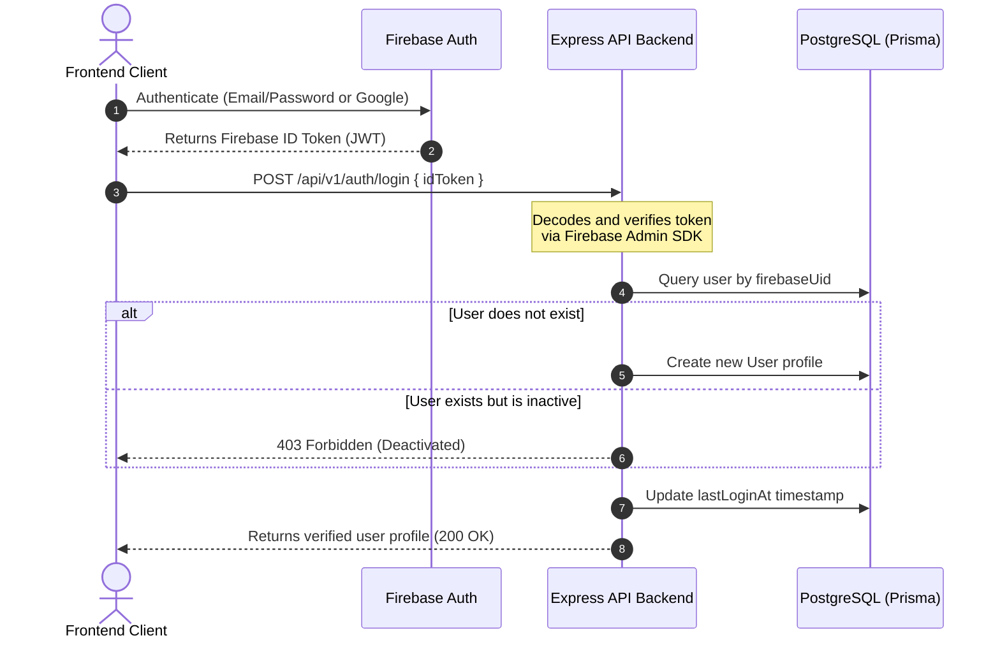

# Authentication Module

This module handles client authentication via Firebase ID Tokens, integrating PostgreSQL profile storage with Firebase Authentication identity provider.

## Authentication Flow



## Firebase Admin SDK Integration

1. The Express backend uses the `firebase-admin` SDK to authenticate tokens.
2. Configuration is loaded in `src/config/firebase.js`.
3. Valid service account credentials can be supplied either via a root-level `firebase.json` file or via environment variables (`FIREBASE_PROJECT_ID`, `FIREBASE_CLIENT_EMAIL`, `FIREBASE_PRIVATE_KEY`).

## Middleware Token Verification Flow (`verifyFirebaseToken`)

For protected routes (e.g. `/api/v1/users/profile`, `/api/v1/auth/me`), the `verifyFirebaseToken` middleware executes the following:

```mermaid
graph TD
    A[Incoming Request] --> B{Has Authorization Header?}
    B -- No --> C[Return 401 Unauthorized]
    B -- Yes --> D{Starts with 'Bearer '?}
    D -- No --> C
    D -- Yes --> E[Extract Token]
    E --> F{Firebase verifyIdToken successful?}
    F -- No --> G[Return 401 Unauthorized]
    F -- Yes --> H[Fetch User by Firebase UID in DB]
    H --> I{User profile exists?}
    I -- No --> J[Return 401 Unauthorized / Profile Missing]
    I -- Yes --> K{User isActive?}
    K -- No --> L[Return 403 Forbidden / Deactivated]
    K -- Yes --> M[Attach user record to req.user]
    M --> N[Call next()]
```

## User Lifecycle

* **User Creation**: Automatically triggered on the first successful login (`POST /auth/login`) if a user profile matching the Firebase UID does not exist in the database.
* **Update Account details**: Via `PATCH /users/profile`, mapped safely to allowed DB columns.
* **User Deactivation**: Under `DELETE /users/profile`, `isActive` is set to `false`. Login and middleware calls will immediately reject subsequent queries.

## Future Integrations

* **Conversation Module**: Private chats and consultation routing will verify participant identities by referencing `req.user.id` (database UUID) or `req.user.firebaseUid`.
* **Python AI Integration**: The FastAPI AI microservice accepts user queries alongside the user's details to provide personalized, context-aware health insights. The FastAPI service verifies calls using tokens or trusted server-to-server security contexts.
