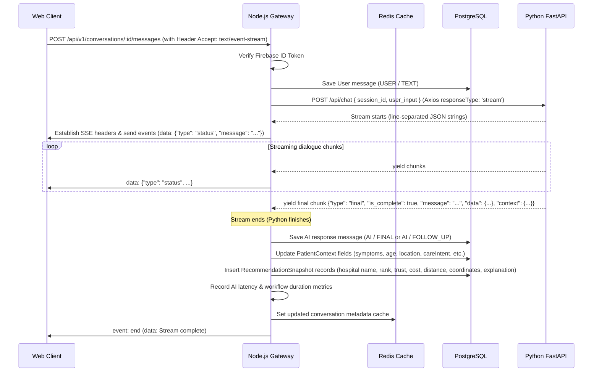

# Conversations & AI Orchestration Module

This module serves as the central orchestration controller and security gateway of the MedPath system, linking client applications to the downstream Python AI microservices.

---

## 🏛️ System Responsibilities

To maintain clean decoupling and prevent architectural bleed:

| Layer / Service | Primary Responsibilities |
| :--- | :--- |
| **Node.js Backend** (Orchestrator) | - Authentication (via Firebase Token Validation) - Validation of schemas and parameters (via Zod) - Security checks & resource ownership validation - Conversational State Management & DB Persistence - Redis Caching (Metadata, Python Uptime) - Streaming Relay (Relaying Python output to clients via SSE) |
| **Python FastAPI** (AI Brain) | - Triage coordinator parsing & metadata extraction (TriageAgent) - Multi-LLM Routing and failovers (Gemini & Mistral) - Real-time medical web-scraping (Playwright, Selenium, Tavily) - Routing optimization and travel driving metrics (Google Maps APIs) - Clinical dept evaluation and hospital ranking (RankerAgent) |

---

## 🔁 Request Lifecycle & SSE Streaming Flow

The integration implements real-time Server-Sent Events (SSE) streaming for a responsive client experience:

---

## 🗄️ Database snapshot strategy

### PatientContext Table
The `PatientContext` table is updated on every final chunk received from the Python microservice. It is updated *strictly* using the parsed `context` payload emitted by Python. Node.js never attempts to parse, infer, or alter any clinical variables.

### RecommendationSnapshots Table
When the conversation's patient context shifts to complete (`is_context_complete: true`), the Python microservice executes its clinical department scraping and ranking, returning an ordered list of recommended hospitals.
- Node.js iterates and stores each candidate inside the `recommendation_snapshots` table.
- Mapped fields: hospital name, ranking position, confidence score, trust score, estimated cost, road distance, coordinates, explanation, source, and creation timestamp.
- **Historical Nature:** This table is strictly append-only. Old snapshots are never overwritten, allowing audit logs of previous recommendation queries.

---

## 📡 Retry Strategy & Failure Recovery

1. **Gateway Retries:**
   Initial HTTP connection handshakes with the Python FastAPI service are wrapped in an exponential backoff wrapper (`requestWithRetryStream`).
   - If Python is offline, overloaded, or returns a `5xx` error, Node.js retries connection up to **3 times**.
   - Backoff starts at **1 second** and doubles on each failure (1s ➔ 2s ➔ 4s).
2. **Failure Metrics:**
   - If connection is lost or retries are exhausted, Node.js increments `metrics:failure_count` in Redis.
   - Standardized API error objects are logged to Winston and returned to the client.
3. **Mid-stream Failures:**
   - If the stream drops *after* headers are written, the Node.js SSE channel emits an `event: error` JSON block before concluding, notifying the client UI to render an alert.

---

## 📊 Orchestration Performance Metrics

Node.js logs performance metrics in Redis under `metrics:*` to analyze service-level-agreements (SLAs) without burdening database tables:

- **Average AI Latency:** Tracked in milliseconds via `metrics:ai_latency_sum` and `metrics:ai_latency_count`.
- **Average Workflow Duration:** Calculated from user submit to stream conclusion.
- **Uptime Tracking:** Tracks the first healthy timestamp when Node.js successfully pings the Python service, recording the uptime duration.
- **Failures and Retries:** Counters increments on connection retry events and workflow crashes.

Metrics and Python health are queryable at the proxy endpoint:
`GET /api/v1/system/python-health` (Cached for 30s in Redis).
