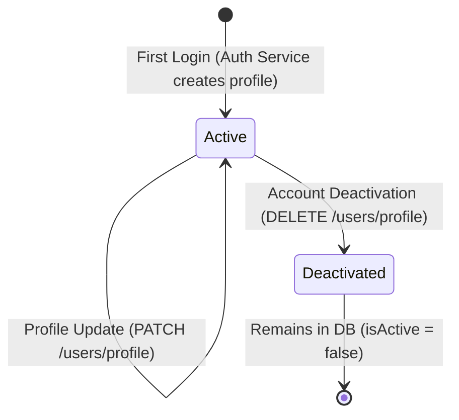

# User Module

This module manages user profiles, preferences, and account metadata in the MedPath platform.

## Database Schema (PostgreSQL)

User details are persisted in the `users` table via Prisma ORM:

* `id` (UUID, Primary Key)
* `firebaseUid` (unique string, linked to Firebase Auth UID)
* `email` (unique string)
* `displayName` (nullable string, holds the user's full name)
* `photoUrl` (nullable string)
* `phoneNumber` (nullable string)
* `preferredLanguage` (string, defaults to 'en')
* `onboardingCompleted` (boolean, defaults to false)
* `createdAt` (timestamp with timezone)
* `updatedAt` (timestamp with timezone, auto-updated)
* `lastLoginAt` (nullable timestamp with timezone)
* `isActive` (boolean, defaults to true)

## User Lifecycle States

1. **Active**: The default state when a user first signs up. The profile is fully operational.
2. **Deactivated**: When a user deactivates their profile, `isActive` is set to `false` (Soft Delete).
   - Inactive users are rejected by the authentication middleware and login service with a `403 Forbidden` response.
   - User data remains in the database to prevent orphaned records in subsequent modules (Conversations, Recommendations, etc.).

## Profile Update Constraints

* **Allowed to Update**:
  - `fullName` (persisted to `displayName` in DB)
  - `preferredLanguage`
  - `phoneNumber`
* **Not Allowed to Update**:
  - `firebaseUid`
  - `email`
  - `id` (UUID)
  - `isActive` (requires deactivation route)
  - `onboardingCompleted` (managed by onboarding/registration flow)

Any attempt to update non-allowed fields is strictly blocked and rejected with a `400 Validation Error` using Zod validation.

## Endpoints

All User endpoints are private and require a valid Firebase ID Token in the `Authorization` header (`Bearer <token>`).

* **`GET /api/v1/users/profile`**: Retrieve the profile of the currently authenticated user.
* **`PATCH /api/v1/users/profile`**: Update allowed profile fields.
* **`DELETE /api/v1/users/profile`**: Soft-delete/deactivate the user account.
